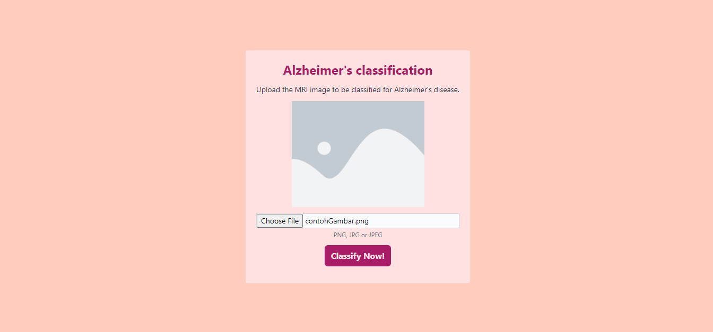

# <p align="center">AlzAware</p>
<p align="center" >
    
</p>

## <p align="center">"Web-based Alzheimer's classification"</p>
  

<p>
AlzAware is a website designed for the classification of Alzheimer's disease based on brain MRI results. The website categorizes Alzheimer's into four classes: 'Mild Demented', 'Moderate Demented', 'Non Demented', and 'Very Mild Demented'. The training dataset for the model is sourced from <a href="https://www.kaggle.com/datasets/tourist55/alzheimers-dataset-4-class-of-images">Kaggle</a>. Through AlzAware, users can access a reliable platform for understanding and categorizing Alzheimer's disease severity.</p>
<div>
<p>This system consists of two parts, namely the folder for training the machine learning model and the folder for the website.</p>

## The System UI
<div align="center">
    
    
</div>
<div align="center">
    
    
</div>

## Installation steps
1.  Clone this repository to your local machine using the git command:
    
    ```bash
    git clone https://github.com/fardanmaulaazizi/AlzAware.git
    ```

2.  Install several required Python modules to run the program.

    ```bash
    pip install -r requirements. txt
    ```
    
3.  Navigate to the 'website' directory.

    ```bash
    cd website
    ```

4.  Run the program by typing the following command in the command prompt :

    ```bash
    python apps.py
    ```

## Note
If you're curious about the machine learning model used on this website, you can explore the "Machine Learning Model Training" folder.
